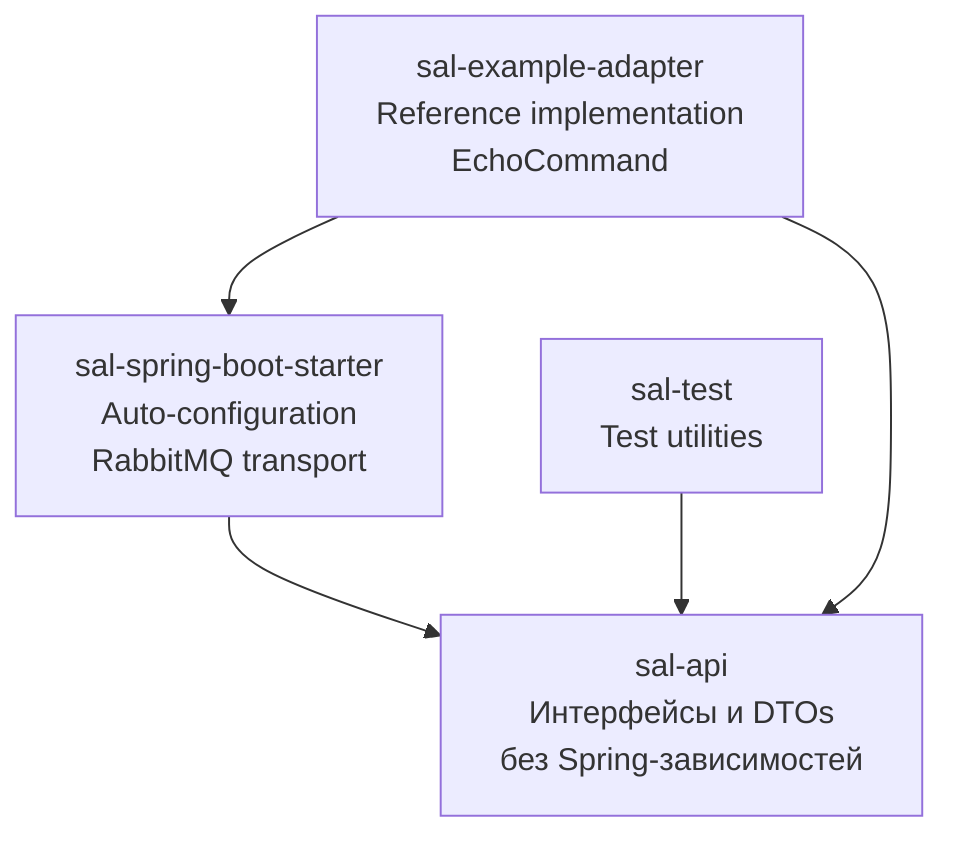
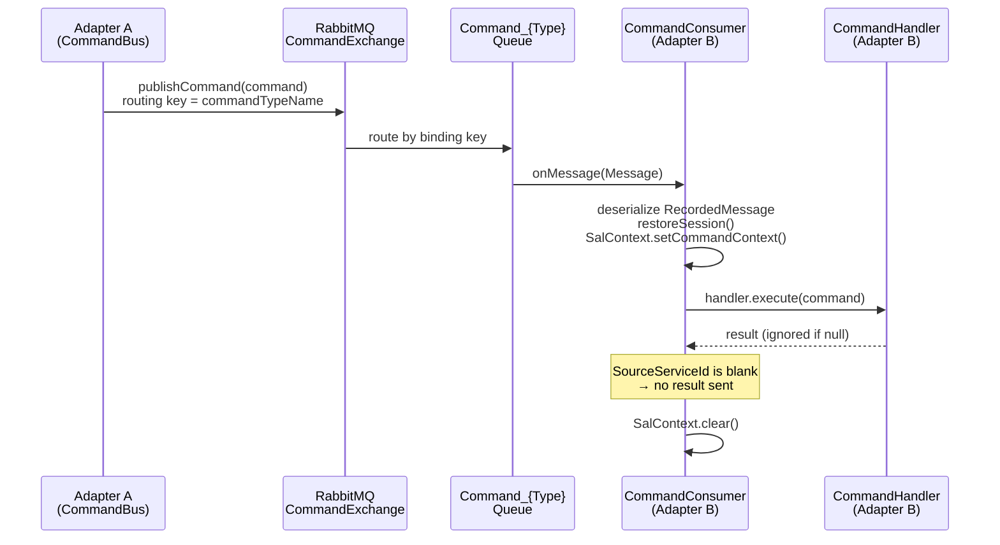
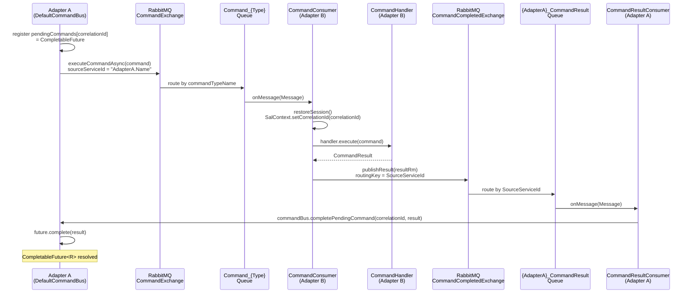
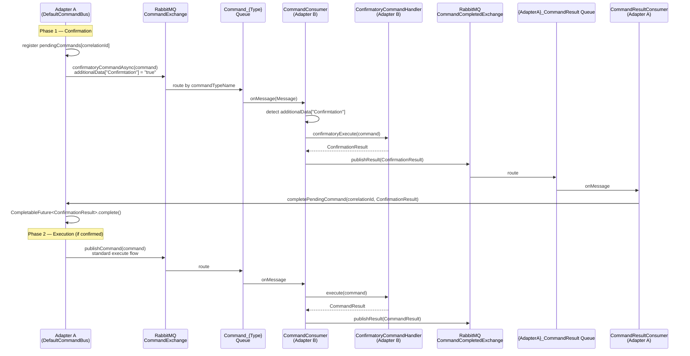
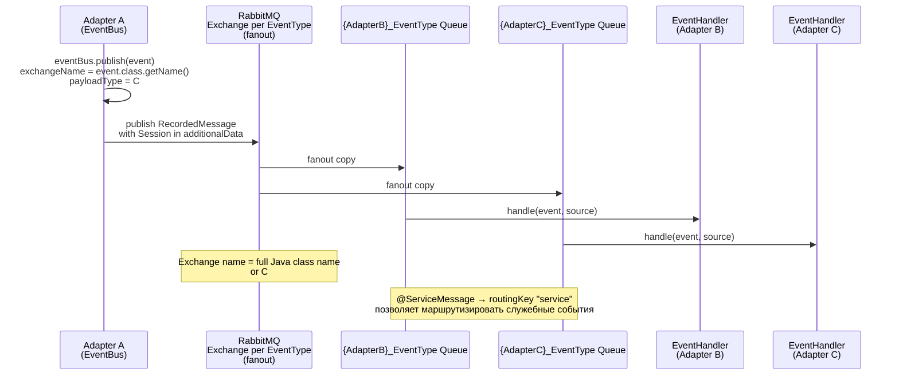
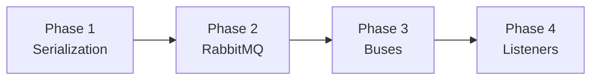
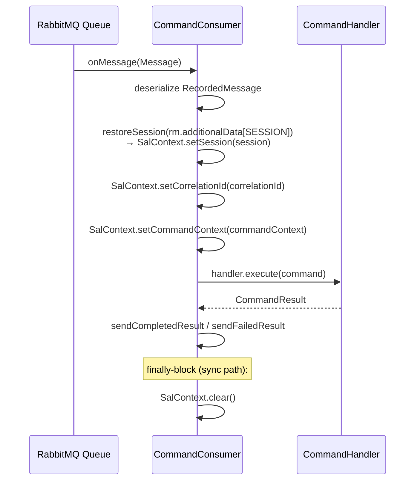

# Архитектура TCB-SAL

> Версия: 2026-03-28. Язык: русский текст, английские термины и код. Диаграммы: Mermaid.

---

## 1. Обзор SAL

**SAL (Service Adapter Layer)** — инфраструктурный фреймворк для асинхронного межадаптерного взаимодействия в экосистеме TCB. SAL обеспечивает:

- **Команды** (request/reply и fire-and-forget) между адаптерами через RabbitMQ.
- **События** (publish/subscribe, fanout) между адаптерами через RabbitMQ.
- **Проброс сессии** (Session) и корреляции (CorrelationId) между адаптерами через AMQP.

Адаптеры на базе SAL — это **non-web Spring Boot приложения** (`spring.main.web-application-type=none`). HTTP-слоя, CORS, Actuator и inter-adapter HTTP healthcheck в текущей версии нет: всё взаимодействие между адаптерами идёт исключительно через RabbitMQ.

TCB-SAL — это **Java/Spring Boot миграция** оригинального C# сервиса `TCB.Infrastructure`. Цель миграции: Java-адаптеры запускаются **в той же production-среде** рядом с C#-адаптерами, используя общий RabbitMQ. Совместимость на уровне wire-формата полностью сохранена (см. [Раздел 10](#10-смешанная-среда-cjava) и [wire-protocol.md](wire-protocol.md)).

Место в экосистеме TCB:

```
┌─────────────────────────────────────────────────────────────────┐
│  TCB Ecosystem                                                  │
│                                                                 │
│  ┌──────────────────┐        ┌──────────────────┐              │
│  │  Java Adapter A  │        │  C# Adapter B    │              │
│  │  (SAL starter)   │        │  (TCB.Infra C#)  │              │
│  └────────┬─────────┘        └────────┬─────────┘              │
│           │                           │                         │
│           └──────────┬────────────────┘                        │
│                      ▼                                          │
│              ┌───────────────┐                                  │
│              │   RabbitMQ    │                                  │
│              │  (shared)     │                                  │
│              └───────────────┘                                  │
└─────────────────────────────────────────────────────────────────┘
```

---

## 2. Модульная структура

Проект состоит из четырёх Maven-модулей:



### sal-api

Ядро абстракций. **Нет зависимостей на Spring**, может использоваться в любом Java-проекте.

| Пакет | Содержимое |
|-------|------------|
| `ru.copperside.sal.api.command` | `Command`, `CommandResult`, `HaveResult<R>`, `CommandBus`, `CommandHandler`, `CommandHandlerAsync`, `ConfirmatoryCommandHandler`, `CommandContext`, `CommandPriority`, `ConfirmationResult`, `FailedResult` |
| `ru.copperside.sal.api.event` | `Event`, `EventBus`, `EventHandler`, `EventSource` |
| `ru.copperside.sal.api.message` | `RecordedMessage` — wire-обёртка для всех AMQP-сообщений |
| `ru.copperside.sal.api.annotation` | `@CommandType`, `@ServiceMessage` |
| `ru.copperside.sal.api.constant` | `Headers`, `MessageDataKeys` — константы wire-протокола |
| `ru.copperside.sal.api.exception` | `SalException` (enum `SalException.Type { ERROR, FATAL, VALIDATION }`), `SalErrorCodes` |

### sal-spring-boot-starter

Реализация транспорта. Spring Boot auto-configuration, регистрируется через `META-INF/spring/org.springframework.boot.autoconfigure.AutoConfiguration.imports`.

| Пакет | Содержимое |
|-------|------------|
| `ru.copperside.sal.starter.command` | `DefaultCommandBus`, `CommandPublisher`, `CommandConsumer`, `CommandResultConsumer`, `CommandHandlerRegistry`, `CommandTimeoutWatcher`, `CommandListenerRegistrar` |
| `ru.copperside.sal.starter.event` | `DefaultEventBus` |
| `ru.copperside.sal.starter.rabbitmq` | `SalMessageConverter`, `SalRabbitAutoConfiguration`, `SalTopologyConfigurer`, `SalRabbitConstants` |
| `ru.copperside.sal.starter.serialization` | `TypeMappingRegistry`, `SalSerializationAutoConfiguration` |
| `ru.copperside.sal.starter.context` | `SalContext` — единый ThreadLocal-фасад для session, CommandContext и correlationId (MDC) |
| `ru.copperside.sal.starter.session` | `SessionSerializer` |
| `ru.copperside.sal.starter.lifecycle` | `AdapterLifecycle` |

### sal-test

Test utilities для написания тестов адаптеров. В текущей версии пуст — будет содержать mock-транспорты и test builders.

### sal-example-adapter

Эталонная реализация адаптера: `EchoCommand` + `EchoCommandHandler` + `EchoRunner`. Демонстрирует корректное использование SAL и служит живой документацией. `EchoRunner` — `@Component`, слушающий `ApplicationReadyEvent`: после небольшой задержки публикует несколько `EchoCommand` через `CommandBus.executeCommandAsync()`, логирует round-trip результаты и завершает работу; адаптер при этом продолжает жить как обычный non-web процесс. Отключается флагом `sal.example.echo-runner.enabled=false`.

---

## 3. Ключевые абстракции

### Command-сторона

```
Command                            — маркерный интерфейс команды
HaveResult<R extends CommandResult>— команда с ожидаемым результатом (R)
CommandResult                      — маркерный интерфейс результата
FailedResult                       — стандартный результат при ошибке
ConfirmationResult                 — результат confirmation-фазы
```

**CommandHandler** — синхронный обработчик:
```java
public interface CommandHandler<C extends Command, R extends CommandResult> {
    R execute(C command);
}
```

**CommandHandlerAsync** — асинхронный обработчик:
```java
public interface CommandHandlerAsync<C extends Command, R extends CommandResult> {
    CompletableFuture<R> executeAsync(C command);
}
```

**ConfirmatoryCommandHandler** — двухфазный обработчик (extends CommandHandler):
```java
public interface ConfirmatoryCommandHandler<C extends Command, R extends CommandResult>
        extends CommandHandler<C, R> {
    ConfirmationResult confirmatoryExecute(C command);
}
```

**CommandBus** — точка входа для отправки команд:

| Метод | Паттерн |
|-------|---------|
| `publishCommand(Command, correlationId, priority)` | Fire-and-forget |
| `publishCommand(RecordedMessage, commandName)` | Fire-and-forget, low-level |
| `executeCommandAsync(HaveResult<R>, timeoutSec, priority)` | Request/reply → `CompletableFuture<R>` |
| `confirmatoryCommandAsync(HaveResult<R>, timeoutSec, priority)` | Confirmatory → `CompletableFuture<ConfirmationResult>` |

### Event-сторона

**EventBus**:
```java
public interface EventBus {
    void publish(Event event);
    void publish(Event... events);
    void publish(RecordedMessage message);  // low-level
}
```

**EventHandler**:
```java
public interface EventHandler<E extends Event> {
    void handle(E event, EventSource source);
}
```

### Wire-уровень

**RecordedMessage** — обёртка для всех AMQP-сообщений:

| Поле | Назначение |
|------|------------|
| `payload` | Объект команды/события/результата |
| `payloadType` | C# full type name (используется для роутинга и десериализации) |
| `correlationId` | UUID для корреляции command ↔ result |
| `sourceServiceId` | `adapterType.adapterName` — обратный адрес для result routing |
| `exchangeName` | RabbitMQ exchange для публикации |
| `routingKey` | RabbitMQ routing key |
| `priority` | Приоритет (0–9) |
| `timeStamp` / `expireDate` | Временны́е метки |
| `additionalData` | Map<String, String>: `Session`, `IsCommand`, `Confirmtation`, `SessionId`, `OperationId` |

### Аннотации

**@CommandType** — маппинг Java-класса на C# type name:
```java
@CommandType("TCB.KCProcessing.Client.ReversalCommand")
public class ReversalCommand implements Command { ... }
```

**@ServiceMessage** — помечает Event как служебное сообщение. Routing key → `"service"`.

---

## 4. Command fire-and-forget flow

Паттерн используется когда нужно отправить команду **без ожидания результата**. `SourceServiceId` не устанавливается (или пуст), и `CommandConsumer` не отправляет ответ.



---

## 5. Command request/reply flow

Паттерн используется для команд, требующих ответа. `DefaultCommandBus` регистрирует `PendingCommand` с `CompletableFuture`, который завершается когда приходит result.



---

## 6. Confirmatory command flow

Двухфазная команда: сначала выполняется быстрая проверка возможности (`confirmatoryExecute`), результат возвращается отправителю. Основное исполнение — отдельный запрос.



---

## 7. Event publish/subscribe flow

События публикуются в **отдельный fanout-exchange на каждый тип события**. Все заинтересованные адаптеры создают свою очередь, привязанную к этому exchange.



---

## 8. Фазы инициализации

Spring Boot auto-configuration запускается в строго определённом порядке через аннотацию `@AutoConfiguration(after = ...)`.

| Фаза | AutoConfiguration | Создаёт бины |
|------|-------------------|--------------|
| **1** | `SalSerializationAutoConfiguration` | `wireObjectMapper` (PascalCase, C#-совместимый), `TypeMappingRegistry`, `SessionSerializer` |
| **2** | `SalRabbitAutoConfiguration` | `SalMessageConverter`, `salRabbitTemplate` (с RetryTemplate), `RabbitAdmin`, `SalTopologyConfigurer` |
| **3** | `CommandBusAutoConfiguration` + `EventBusAutoConfiguration` | `CommandHandlerRegistry`, `CommandPublisher`, `DefaultCommandBus`, `CommandTimeoutWatcher`, `DefaultEventBus` |
| **4** | `CommandListenerAutoConfiguration` | `CommandConsumer`, `CommandResultConsumer`, `commandListenerContainer`, `commandResultListenerContainer`, `CommandListenerRegistrar` |

**Важно**: RabbitMQ-слушатели (`CommandListenerContainer`) стартуют **не при старте контейнера**, а на событии `ApplicationReadyEvent` через `CommandListenerRegistrar`. Это гарантирует, что все handler-бины зарегистрированы и топология RabbitMQ объявлена до приёма первого сообщения.



---

## 9. Контекст и сессия

### ThreadLocal-модель

SAL использует единый ThreadLocal-фасад `SalContext`, объединяющий session, command context и MDC correlation id:

| API | Содержимое | C# аналог |
|-----|------------|-----------|
| `SalContext.session()` / `SalContext.setSession(Map)` | `Map<String, Object>` — доменные данные сессии (SessionId, OperationId, и т.д.) | `CallContext.LogicalSetData("Session")` |
| `SalContext.commandContext()` / `SalContext.setCommandContext(CommandContext)` | `CommandContext` — тип команды, correlationId, sourceServiceId, timestamps | `CurrentCommand` |
| `SalContext.setCorrelationId(String)` | SLF4J MDC: единственный ключ `correlationId` (константа `SalContext.MDC_CORRELATION_ID`) | logging context |
| `SalContext.clear()` | Очищает все три ThreadLocal-ячейки и MDC | — |

Отдельных MDC-ключей `sessionId`/`adapterName` больше нет — только `correlationId`.

### RabbitMQ entry point



**Async handler**: для `CommandHandlerAsync` `CommandConsumer` захватывает полный `ContextSnapshot` (session + `CommandContext` + correlationId) **до** вызова `executeAsync()` и восстанавливает его в `whenComplete()` callback. Внутренний флаг `asyncDispatched` удерживает вызывающий поток от очистки ThreadLocal-ов, пока async-обработчик ещё в полёте.

---

## 10. Смешанная среда C#/Java

### Совместное существование адаптеров

В production-среде Java и C# адаптеры разделяют один RabbitMQ. Взаимодействие прозрачно: Java-адаптер может отправить команду C#-адаптеру и наоборот.

```
Java Adapter                C# Adapter
     │                           │
     │   RecordedMessage         │
     │──── (wire-format) ────────│
     │   CommandExchange         │
     │                           │
     └──── shared RabbitMQ ──────┘
```

### Wire-совместимость

| Аспект | Java (SAL) | C# (TCB.Infrastructure) |
|--------|-----------|------------------------|
| JSON naming | PascalCase (`wireObjectMapper`) | Newtonsoft.Json default (PascalCase) |
| Null handling | `NON_NULL` (skip nulls) | `NullValueHandling.Ignore` |
| Enums | `WRITE_ENUMS_USING_TO_STRING` | `StringEnumConverter` |
| Dates | ISO 8601 (JavaTimeModule) | `IsoDateTimeConverter` |
| Session compression | GZip + Base64 (`SessionSerializer`) | GZip + Base64 |
| `FailedResult.Exeption` | Поле сохранено с опечаткой C# | C# оригинал с опечаткой |
| `additionalData["Confirmtation"]` | Опечатка сохранена | C# оригинал с опечаткой |

### TypeMappingRegistry

Ключевой механизм C#↔Java совместимости. При старте сканирует классы с `@CommandType` и строит двустороннюю карту:

```
C# type name                              ↔  Java class
"TCB.KCProcessing.Client.ReversalCommand" ↔  ReversalCommand.class
```

**При отправке**: `DefaultCommandBus` и `DefaultEventBus` используют `TypeMappingRegistry.resolveCsharpTypeName()` — `payloadType` в `RecordedMessage` содержит C# имя типа.

**При получении**: `SalMessageConverter` использует `TypeMappingRegistry.resolveJavaClass()` — десериализует payload в правильный Java-класс по C# имени из `payloadType`.

### AMQP property mapping

`SalMessageConverter` маппирует поля `RecordedMessage` на AMQP message properties:
- `correlationId` → AMQP `correlationId`
- `priority` → AMQP `priority`
- Сериализация `RecordedMessage` в JSON (PascalCase) → AMQP body bytes

Подробнее — в [wire-protocol.md](wire-protocol.md).

---

## 11. См. также

| Документ | Содержание |
|----------|------------|
| [glossary.md](glossary.md) | Глоссарий терминов TCB-SAL |
| [adapter-development-guide.md](adapter-development-guide.md) | Руководство разработчика адаптеров: Quick Start, CommandBus, EventBus, тестирование |
| [core-development-guide.md](core-development-guide.md) | Руководство разработчика ядра SAL: контракты компонентов, тех. долг |
| [operations-guide.md](operations-guide.md) | Эксплуатация: деплой, мониторинг, масштабирование, graceful shutdown |
| [configuration-reference.md](configuration-reference.md) | Все свойства `application.yml` (`sal.*`) с описанием и примерами |
| [wire-protocol.md](wire-protocol.md) | Детали wire-формата: AMQP properties, JSON schema, session compression |
| [troubleshooting.md](troubleshooting.md) | Диагностика и решение типичных проблем |
