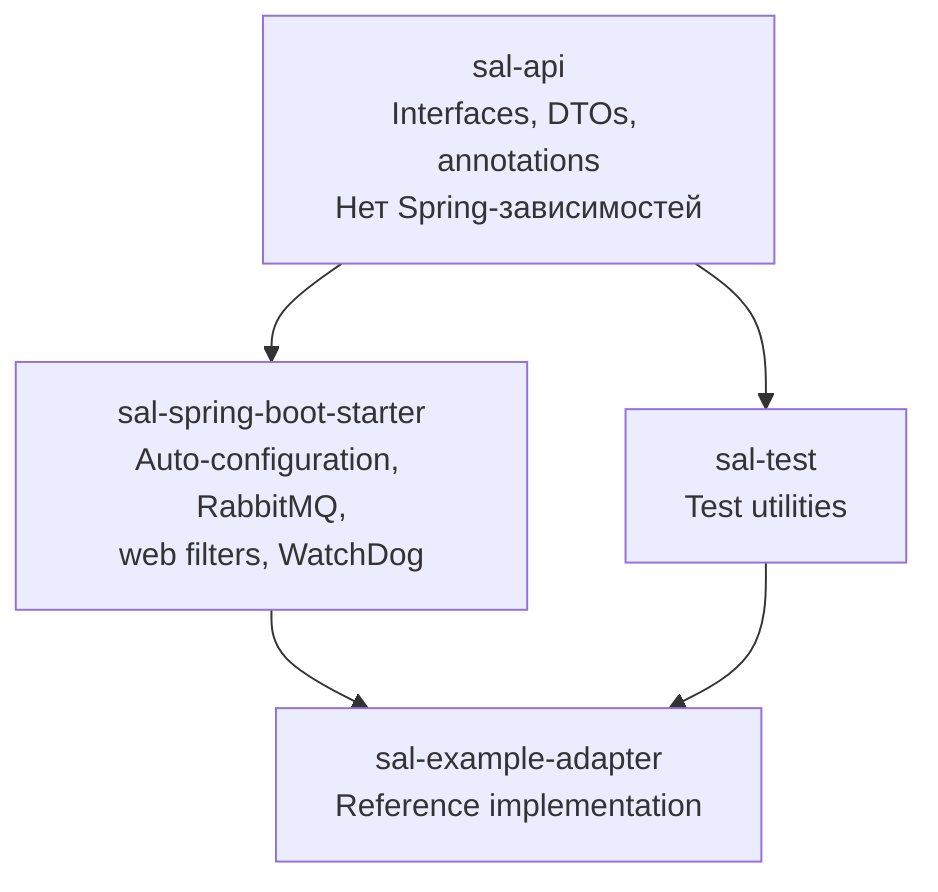
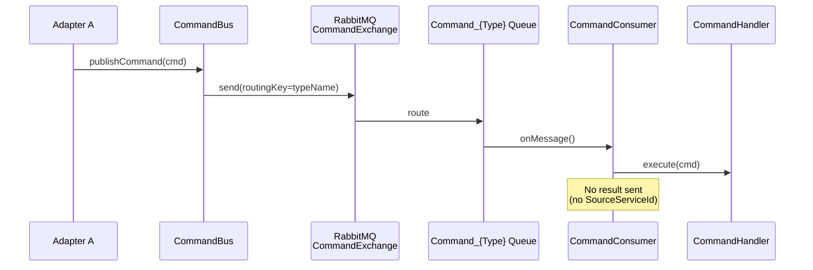
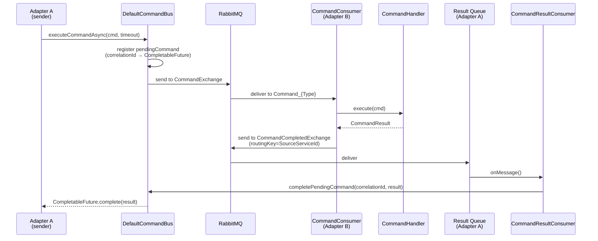
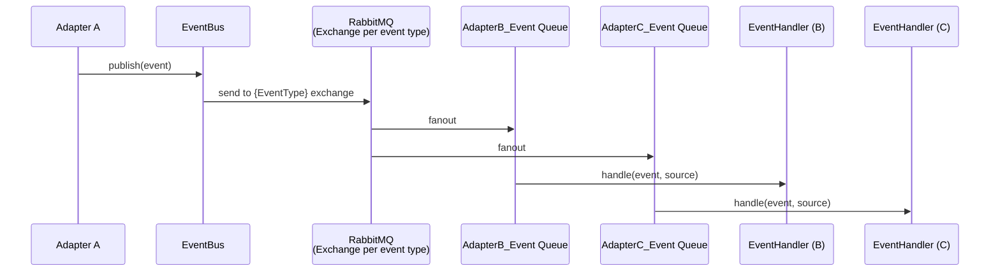
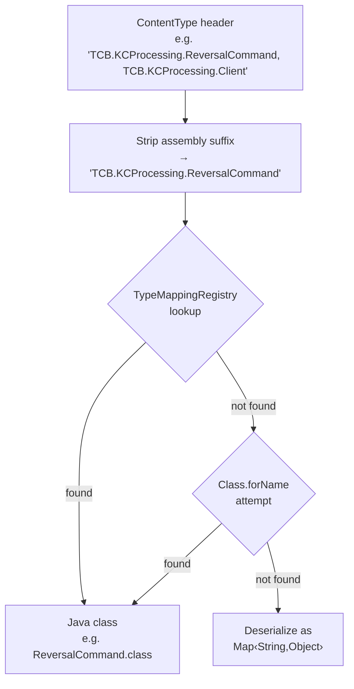

# TCB-SAL Project Documentation — Implementation Plan

> **For agentic workers:** REQUIRED SUB-SKILL: Use superpowers:subagent-driven-development (recommended) or superpowers:executing-plans to implement this plan task-by-task. Steps use checkbox (`- [ ]`) syntax for tracking.

**Goal:** Создать полный пакет проектной документации (8 документов) для внедрения, сопровождения и развития модуля TCB-SAL.

**Architecture:** Модульная документация — каждый документ самодостаточен, с перекрёстными ссылками. Язык смешанный: русский текст, английские термины и код. Диаграммы в Mermaid. Все документы размещаются в `docs/`.

**Tech Stack:** Markdown, Mermaid diagrams, примеры из исходников проекта.

**Spec:** `docs/superpowers/specs/2026-03-28-project-documentation-design.md`

---

## Task 1: glossary.md

**Files:**
- Create: `docs/glossary.md`

Начинаем с глоссария — на него будут ссылаться все остальные документы.

- [ ] **Step 1: Написать глоссарий**

```markdown
# Глоссарий TCB-SAL

Справочник терминов, используемых в документации и исходном коде модуля SAL.

| Термин | Определение |
|--------|-------------|
| **Adapter** | Самостоятельный сервис в экосистеме TCB, взаимодействующий с другими адаптерами через SAL. Каждый адаптер имеет уникальное имя (`sal.adapter.name`) и тип (`sal.adapter.type`). |
| **Command** | Сообщение-запрос, отправляемое одним адаптером другому через CommandBus. Реализует интерфейс `Command`. |
| **CommandResult** | Ответное сообщение на команду. Реализует интерфейс `CommandResult`. |
| **CommandBus** | Шина команд — отправка и получение команд между адаптерами через RabbitMQ. Интерфейс `CommandBus`, реализация `DefaultCommandBus`. |
| **CommandHandler** | Обработчик входящей команды. Может быть синхронным (`CommandHandler`), асинхронным (`CommandHandlerAsync`) или двухфазным (`ConfirmatoryCommandHandler`). |
| **Confirmatory Command** | Двухфазная команда: сначала выполняется предварительная проверка (confirmation), затем — основная обработка. |
| **CorrelationId** | UUID, связывающий command и его result. Используется для корреляции в логах и в механизме request/reply. |
| **EndPoint** | Экземпляр удалённого адаптера, за которым следит WatchDog. Содержит URI, статус доступности, версию SAL. |
| **EnvironmentKey** | Общий секрет среды. Проверяется `EnvironmentKeyInterceptor` при каждом HTTP-запросе. Задаётся в `sal.service.environment-key`. |
| **Event** | Доменное событие, публикуемое через EventBus по модели publish/subscribe. Реализует интерфейс `Event`. |
| **EventBus** | Шина событий — публикация событий всем подписчикам через RabbitMQ. Интерфейс `EventBus`, реализация `DefaultEventBus`. |
| **EventHandler** | Обработчик входящего события. Реализует интерфейс `EventHandler<E>`. |
| **Fire-and-Forget** | Паттерн отправки команды без ожидания результата. Используется когда `SourceServiceId` отсутствует. |
| **MDC** | Mapped Diagnostic Context (SLF4J). SAL записывает `correlationId`, `sessionId`, `adapterName` для корреляции логов. Утилита `SalMdc`. |
| **RecordedMessage** | Внутренняя обёртка сообщения SAL. Содержит payload, метаданные (correlationId, priority, timestamps), AdditionalData. Маппится на AMQP properties при отправке/по��учении. |
| **Request/Reply** | Паттерн отправки команды с ожиданием результата. `CommandBus.executeCommandAsync()` возвращает `CompletableFuture<R>`. |
| **SAL** | Service Adapter Layer — инфраструктурный фреймворк для межадаптерного взаимодействия в экосистеме TCB. |
| **@ServiceMessage** | Аннотация на Event-классе. Меняет routing key на `"service"`, что позволяет создать отдельную очередь для служебных сообщений. |
| **Session** | Контекстные данные (Map<String, Object>), пробрасываемые между адаптерами. Хранятся в `SessionHolder` (ThreadLocal), сериализуются в compressed Base64 для передачи. |
| **SessionHolder** | ThreadLocal-контейнер для session data текущего потока. Аналог C# `CallContext.LogicalSetData("Session")`. |
| **TypeMappingRegistry** | Реестр bidirectional маппинга C#-имён типов на Java-классы. Используется `SalMessageConverter` при десериализации payload по `ContentType` header. |
| **WatchDog** | Подсистема мониторинга здоровья адаптера. Периодически пингует зависимые EndPoint'ы и управляет состоянием online/offline. |
| **Wire-format** | Формат данных на проводе (AMQP + JSON). PascalCase, совместимый с C# Newtonsoft.Json. Определяется `wireObjectMapper`. |
| **@CommandType** | Аннотация, задающая wire-имя команды (обычно C# полное имя типа). Используется для регистрации в `CommandHandlerRegistry` и `TypeMappingRegistry`. |
```

- [ ] **Step 2: Commit**

```bash
git add docs/glossary.md
git commit -m "docs: add glossary of SAL terms"
```

---

## Task 2: architecture.md

**Files:**
- Create: `docs/architecture.md`

**References to read:**
- `sal-api/src/main/java/ru/copperside/sal/api/command/CommandBus.java` — CommandBus interface
- `sal-api/src/main/java/ru/copperside/sal/api/event/EventBus.java` — EventBus interface
- `sal-spring-boot-starter/src/main/java/ru/copperside/sal/starter/SalAutoConfiguration.java` — auto-configuration entry
- `sal-spring-boot-starter/src/main/java/ru/copperside/sal/starter/command/CommandConsumer.java` — command processing flow
- `sal-spring-boot-starter/src/main/java/ru/copperside/sal/starter/command/DefaultCommandBus.java` — CommandBus impl
- `sal-spring-boot-starter/src/main/java/ru/copperside/sal/starter/event/DefaultEventBus.java` — EventBus impl
- `sal-spring-boot-starter/src/main/java/ru/copperside/sal/starter/context/SessionHolder.java` — session ThreadLocal
- `sal-spring-boot-starter/src/main/java/ru/copperside/sal/starter/context/CommandContextHolder.java` — command context ThreadLocal
- `sal-spring-boot-starter/src/main/java/ru/copperside/sal/starter/context/SalMdc.java` — MDC utility
- `sal-spring-boot-starter/src/main/java/ru/copperside/sal/starter/serialization/TypeMappingRegistry.java` — type mapping

Документ должен содержать следующие секции. Каждая секция — отдельный шаг.

- [ ] **Step 1: Обзор SAL**

Назначение модуля, место в экосистеме TCB, общая модель взаимодействия адаптеров. Указать что это Java/Spring Boot миграция C#-инфраструктуры с сохранением wire-совместимости. Перечислить ключевые возможности: commands, events, session propagation, health monitoring.

- [ ] **Step 2: Модульная структура**

Описать 4 Maven-модуля с диаграммой зависимостей:



Для каждого модуля: назначение, ключевые пакеты, зависимости.

- [ ] **Step 3: Ключевые абстракции**

Описать интерфейсы из sal-api:
- `Command`, `CommandResult`, `HaveResult<R>` — модель команд
- `CommandHandler<C,R>`, `CommandHandlerAsync<C,R>`, `ConfirmatoryCommandHandler<C,R>` — обработчики
- `CommandBus` — интерфейс шины команд (методы: `publishCommand`, `executeCommandAsync`, `confirmatoryCommandAsync`)
- `Event`, `EventHandler<E>`, `EventBus` — модель событий
- `RecordedMessage` — wire-обёртка сообщения
- `@CommandType`, `@ServiceMessage` — аннотации

- [ ] **Step 4: Потоки данных — Command fire-and-forget**

Mermaid sequence diagram:



- [ ] **Step 5: Потоки данных — Command request/reply**

Mermaid sequence diagram:



- [ ] **Step 6: Потоки данных — Confirmatory command flow**

Mermaid sequence diagram, аналогичный request/reply но с двумя фазами: confirmation → execution. Описать `ConfirmatoryCommandHandler.confirmatoryExecute()` → `ConfirmationResult` → финальный `execute()`.

- [ ] **Step 7: Потоки данных — Event publish/subscribe**

Mermaid sequence diagram:



- [ ] **Step 8: Фазы инициализации**

Таблица фаз auto-configuration:

| Фаза | AutoConfiguration | Что создаёт |
|------|-------------------|-------------|
| 1 | `SalSerializationAutoConfiguration` | `wireObjectMapper`, `TypeMappingRegistry`, `SessionSerializer` |
| 2 | `SalRabbitAutoConfiguration` | `SalMessageConverter`, `salRabbitTemplate`, `RabbitAdmin`, `SalTopologyConfigurer` |
| 3 | `CommandBusAutoConfiguration`, `EventBusAutoConfiguration` | `CommandHandlerRegistry`, `CommandPublisher`, `DefaultCommandBus`, `CommandTimeoutWatcher`, `DefaultEventBus` |
| 4 | `WebAutoConfiguration` | `AdapterState`, filters (`SalContextFilter`, `SessionFilter`, `RequestLoggingFilter`), interceptors (`EnvironmentKeyInterceptor`, `OfflineCheckInterceptor`), `SalExceptionHandler` |
| 5 | `WatchDogAutoConfiguration` | `EndPointRegistry`, `WatchDogService`, `SalRestClient`, schedulers, `AdapterLifecycle`, `AdapterStateHealthIndicator` |
| 6 | `CommandListenerAutoConfiguration` | `CommandConsumer`, `CommandResultConsumer`, listener containers, `CommandListenerRegistrar` |

- [ ] **Step 9: Контекст и сессия**

Описать ThreadLocal-модель:
- `SessionHolder` — Map<String, Object>, аналог C# CallContext
- `CommandContextHolder` — CommandContext (commandType, correlationId, sourceServiceId, timestamps)
- `SalMdc` — MDC keys: correlationId, sessionId, adapterName

Жизненный цикл для двух entry points:

**HTTP:**
1. `SalContextFilter` → устанавливает MDC (correlationId из заголовков или генерирует)
2. `SessionFilter` → извлекает session из body, устанавливает `SessionHolder`
3. Controller обрабатывает запрос
4. `SessionFilter.finally` → сериализует session в response body
5. `SalContextFilter.finally` → очищает MDC

**RabbitMQ:**
1. `CommandConsumer.onMessage()` → восстанавливает session из AdditionalData, устанавливает MDC и CommandContextHolder
2. Handler обрабатывает команду
3. `finally` → очищает SessionHolder, CommandContextHolder, SalMdc

- [ ] **Step 10: Смешанная среда C#/Java**

Описать:
- Общий RabbitMQ: все адаптеры (C# и Java) используют одни и те же exchanges и conventions
- Wire-совместимость: PascalCase JSON, AMQP property mapping, session compression format
- TypeMappingRegistry: Java-адаптер регистрирует маппинг C#-имён на Java-классы для десериализации payload
- Ограничения: exchange names для событий (Java использует Java FQDN, C# — C# FQDN), решается через TypeMappingRegistry

Ссылки на `wire-protocol.md` для деталей.

- [ ] **Step 11: Commit**

```bash
git add docs/architecture.md
git commit -m "docs: add architecture overview"
```

---

## Task 3: adapter-development-guide.md

**Files:**
- Create: `docs/adapter-development-guide.md`

**References to read:**
- `sal-example-adapter/` — весь модуль как образец
- `sal-api/src/main/java/ru/copperside/sal/api/command/` — все интерфейсы
- `sal-api/src/main/java/ru/copperside/sal/api/event/` �� Event, EventHandler
- `sal-api/src/main/java/ru/copperside/sal/api/annotation/CommandType.java` — аннотация
- `sal-api/src/main/java/ru/copperside/sal/api/annotation/ServiceMessage.java` — аннотация
- `sal-api/src/main/java/ru/copperside/sal/api/exception/` — ErrorException, ValidationException, FatalException
- `sal-spring-boot-starter/src/main/java/ru/copperside/sal/starter/context/SessionHolder.java`
- `sal-example-adapter/src/main/resources/application.yml` — reference config

- [ ] **Step 1: Quick Start**

Пошаговое руководство (5 шагов) создания минимального адаптера:

1. pom.xml с зависимостью `sal-spring-boot-starter`
2. application.yml с минимальной конфигурацией (adapter.name, adapter.type, rabbitmq)
3. `@SpringBootApplication` класс
4. Простой CommandHandler (на примере EchoCommand из example-adapter)
5. Запуск: `docker-compose up -d && mvn spring-boot:run`

Полные листинги кода для каждого шага. Включить вывод логов при успешном запуске:
```
CommandBus - [BUS] Command listener started on 1 queue(s): [Command_...]
```

- [ ] **Step 2: Структура проекта адаптера**

Рекомендуемая структура пакетов:
```
com.example.myadapter/
├── MyAdapterApplication.java
├── command/
│   ├── MyCommand.java
│   ├── MyCommandResult.java
│   └── MyCommandHandler.java
├── event/
│   ├── MyEvent.java
│   └── MyEventHandler.java
├── controller/
│   └── PingController.java (обязательный)
└── config/
    └── TypeMappingConfig.java (если нужен C# interop)
```

- [ ] **Step 3: Работа с командами — определение типов**

Как определить Command + CommandResult:
- Класс команды: implements `Command` (fire-and-forget) или `HaveResult<R>` (request/reply)
- Аннотация `@CommandType("C#.Full.TypeName")` — обязательна для C# interop
- Класс результата: implements `CommandResult`
- Все поля — JavaBean properties (getter/setter), сериализуются в PascalCase на проводе

Пример на базе EchoCommand/EchoResult из example-adapter.

- [ ] **Step 4: Работа с командами — синхронный CommandHandler**

```java
@Component
public class MyCommandHandler implements CommandHandler<MyCommand, MyResult> {
    @Override
    public MyResult execute(MyCommand command) {
        // business logic
        MyResult result = new MyResult();
        result.setData(process(command));
        return result;
    }
}
```

Объяснить: `@Component` обязателен (Spring сканирует бины), generic-параметры определяют маппинг command→handler, handler автоматически регистрируется в `CommandHandlerRegistry`.

- [ ] **Step 5: Работа �� командами — асинхронный CommandHandlerAsync**

Когда использовать: длительные операции, вызовы внешних сервисов, параллельная обработка.

```java
@Component
public class LongRunningHandler implements CommandHandlerAsync<LongCommand, LongResult> {
    @Override
    public CompletableFuture<LongResult> executeAsync(LongCommand command) {
        return CompletableFuture.supplyAsync(() -> {
            // long operation
            return new LongResult();
        });
    }
}
```

Предупреждение: ThreadLocal-контекст (SessionHolder, MDC) автоматически пробрасывается в async callback — но только для отправки результата. Если внутри `supplyAsync` нужен доступ к сессии, нужно захватить её до вызова.

- [ ] **Step 6: Работа с командами — ConfirmatoryCommandHandler**

```java
@Component
public class TransferHandler implements ConfirmatoryCommandHandler<TransferCommand, TransferResult> {
    @Override
    public ConfirmationResult confirmatoryExecute(TransferCommand command) {
        // Phase 1: validate, check limits
        return new ConfirmationResult(); // or throw
    }

    @Override
    public TransferResult execute(TransferCommand command) {
        // Phase 2: actually execute transfer
        return new TransferResult();
    }
}
```

Объяснить двухфазный flow и когда он нужен.

- [ ] **Step 7: Работа с командами — отправка команд другим адаптерам**

Fire-and-forget:
```java
@Autowired CommandBus commandBus;

commandBus.publishCommand(new MyCommand("data"));
```

Request/reply:
```java
CompletableFuture<MyResult> future = commandBus.executeCommandAsync(
    new MyCommand("data"), 30, CommandPriority.Normal);
MyResult result = future.join(); // blocking
```

Таймауты, приоритеты (`CommandPriority`: Low=0, Normal=5, High=10).

- [ ] **Step 8: Работа с событиями**

Определение события:
```java
public class OrderCreatedEvent implements Event {
    private String orderId;
    // getters/setters
}
```

`@ServiceMessage` — для служебных событий (отдельная очередь routing key `"service"`).

Публикация:
```java
@Autowired EventBus eventBus;
eventBus.publish(new OrderCreatedEvent("123"));
```

Подписка:
```java
@Component
public class OrderEventHandler implements EventHandler<OrderCreatedEvent> {
    @Override
    public void handle(OrderCreatedEvent event, EventSource source) {
        // react to event
    }
}
```

- [ ] **Step 9: Сессия**

Чтение сессии:
```java
Map<String, Object> session = SessionHolder.get();
String sessionId = SessionHolder.getSessionId();
```

Запись в сессию:
```java
Map<String, Object> session = SessionHolder.get();
if (session == null) session = new HashMap<>();
session.put("MyKey", "value");
SessionHolder.set(session);
```

Автоматическое пробрасывание: SAL автоматически сериализует session в исходящие сообщения (команды, события, HTTP-ответы) и восстанавливает из входящих.

- [ ] **Step 10: HTTP-контроллеры**

PingController — обязательный для WatchDog:
```java
@RestController
public class PingController {
    @GetMapping("/ping")
    public PingResponse ping() { ... }
}
```

Кастомные контроллеры: обычные Spring MVC, session доступна через `SessionHolder`, EnvironmentKey проверяется автоматически interceptor'ом.

- [ ] **Step 11: Регистрация типов для C# interop**

```java
@Configuration
public class TypeMappingConfig {
    @Bean
    public CommandLineRunner registerTypes(TypeMappingRegistry registry) {
        return args -> {
            registry.register("TCB.MySystem.MyCommand, TCB.MySystem.Client", MyCommand.class);
            registry.register("TCB.MySystem.MyResult, TCB.MySystem.Client", MyResult.class);
        };
    }
}
```

Объяснить: без регистрации C#-адаптер отправит команду с C#-именем типа, и Java-адаптер не сможет десериализовать payload.

- [ ] **Step 12: Обработка ошибок**

Три типа исключений:
- `ErrorException` — бизнес-ошибка (HTTP 400)
- `ValidationException` — ошибка валидации (HTTP 400, с деталями по полям)
- `FatalException` — фатальная ошибка (HTTP 500)

Все наследуют `SalBaseException`. `SalExceptionHandler` автоматически конвертирует в HTTP-ответ с `InfrastructureExceptionDTO`.

Пример:
```java
throw new ErrorException(SalErrorCodes.NO_AVAILABLE_ENDPOINT);
```

- [ ] **Step 13: Тестирование**

Unit-тест handler'а:
```java
@Test
void echoHandler_returnsPayload() {
    EchoCommandHandler handler = new EchoCommandHandler();
    EchoCommand cmd = new EchoCommand();
    cmd.setPayload("test");
    EchoResult result = handler.execute(cmd);
    assertEquals("test", result.getEcho());
}
```

Интеграционный тест с `@SpringBootTest`:
```java
@SpringBootTest
class MyAdapterTest {
    @Test
    void contextLoads() { }
}
```

Тест wire-совместимости (JSON format):
```java
ObjectMapper wireMapper = new SalSerializationAutoConfiguration().wireObjectMapper();
String json = wireMapper.writeValueAsString(new MyCommand("test"));
assertTrue(json.contains("\"Payload\""));  // PascalCase
```

- [ ] **Step 14: ��еклист перед деплоем**

Таблица обязательных проверок:
- [ ] `@CommandType` аннотации на всех командах
- [ ] TypeMappingRegistry — зарегистрированы все C# типы
- [ ] PingController — реализован
- [ ] application.yml — `sal.adapter.name` и `sal.adapter.type` заданы
- [ ] Unit-тесты handler'ов проходят
- [ ] Wire-compatibility тест — JSON в PascalCase
- [ ] Интеграционный тест — Spring context поднимается

- [ ] **Step 15: Commit**

```bash
git add docs/adapter-development-guide.md
git commit -m "docs: add adapter development guide"
```

---

## Task 4: wire-protocol.md

**Files:**
- Create: `docs/wire-protocol.md`

**References to read:**
- `sal-spring-boot-starter/src/main/java/ru/copperside/sal/starter/rabbitmq/SalMessageConverter.java` — AMQP property mapping
- `sal-spring-boot-starter/src/main/java/ru/copperside/sal/starter/rabbitmq/SalRabbitConstants.java` — topology constants
- `sal-spring-boot-starter/src/main/java/ru/copperside/sal/starter/serialization/SalSerializationAutoConfiguration.java` — wireObjectMapper config
- `sal-spring-boot-starter/src/main/java/ru/copperside/sal/starter/serialization/TypeMappingRegistry.java` — type resolution
- `sal-spring-boot-starter/src/main/java/ru/copperside/sal/starter/session/SessionSerializer.java` — session compression
- `sal-spring-boot-starter/src/main/java/ru/copperside/sal/starter/web/SessionFilter.java` — HTTP session propagation
- `sal-api/src/main/java/ru/copperside/sal/api/constant/Headers.java` — HTTP headers
- `sal-api/src/main/java/ru/copperside/sal/api/message/RecordedMessage.java` — message structure

- [ ] **Step 1: Общие принципы**

JSON over AMQP. Совместимость с C# Newtonsoft.Json. PascalCase naming strategy. Описать wireObjectMapper settings:
- `PropertyNamingStrategies.UPPER_CAMEL_CASE`
- `JsonInclude.Include.NON_NULL`
- Enums as strings
- ISO 8601 dates (no timestamps)
- Unknown properties ignored

- [ ] **Step 2: AMQP Message Format**

Полная таблица маппинга `RecordedMessage` ↔ AMQP properties:

| RecordedMessage поле | AMQP Property | Формат | Пример |
|---|---|---|---|
| `payload` | Body | JSON bytes (UTF-8) | `{"Payload":"hello"}` |
| `payloadType` | ContentType | C# или Java FQDN | `ru.copperside.sal.example.EchoCommand` |
| `messageId` | MessageId | Long → String | `"42"` |
| `correlationId` | CorrelationId | UUID string | `"550e8400-e29b-41d4-a716-446655440000"` |
| `priority` | Priority | int (0-10) | `5` |
| `timeStamp` | Timestamp | java.util.Date | `2026-03-28T12:00:00Z` |
| `expireDate` | Expiration | ms от timeStamp | `"30000"` |
| `additionalData` + `sourceServiceId` | Header `Additional-Data` | JSON bytes | `{"SourceServiceId":"Adapter.name","IsCommand":"","Session":"..."}` |

- [ ] **Step 3: JSON Serialization Rules**

Правила с примерами:

```java
// Java class
public class EchoCommand {
    private String payload;  // getter/setter
}
```

```json
// Wire JSON (PascalCase, nulls omitted)
{"Payload":"Hello from SAL"}
```

Привести примеры для: String, int, boolean, enum, Instant (ISO 8601), List, nested object.

- [ ] **Step 4: Session Wire Format**

Пошаговая схема:
1. `Map<String, Object>` → JSON string (wireObjectMapper, PascalCase)
2. JSON → UTF-8 bytes
3. Prepend 7-bit encoded length (C# BinaryWriter.Write7BitEncodedInt format)
4. Deflate compression (raw, без zlib header, `Deflater.DEFLATED` + `nowrap=true`)
5. Base64 encode

Обратный процесс:
1. Base64 decode
2. Inflate (raw, `nowrap=true`)
3. Read 7-bit encoded int (length)
4. Read N bytes → UTF-8 string
5. JSON → Map

Описание формата 7-bit encoded int:
```
Value 0-127:     1 byte  [value]
Value 128-16383: 2 bytes [value & 0x7F | 0x80] [value >> 7]
...
```

- [ ] **Step 5: HTTP Session Propagation**

Заголовок: `TCB.Header-Session`
Значение: `"{bodyOffset};{sessionLength}"`

Request body layout:
```
[actual request payload bytes: 0..bodyOffset]
[session compressed Base64 bytes: bodyOffset..bodyOffset+sessionLength]
```

Response body layout (аналогичный):
```
[actual response payload bytes: 0..bodyLength]
[session compressed Base64 bytes: bodyLength..bodyLength+sessionLength]
```

Пример curl-запроса с сессией.

- [ ] **Step 6: RabbitMQ Topology Contract**

Exchanges (фиксированные имена, нельзя менять):

| Exchange | Type | Назначение |
|---|---|---|
| `CommandExchange` | Direct | Маршрутизация команд по routing key = type name |
| `TCB.Infrastructure.Command.CommandCompletedEvent` | Direct | Результаты команд (успех), routing key = SourceServiceId |
| `TCB.Infrastructure.Command.CommandFailedEvent` | Direct | Результаты команд (ошибка), routing key = SourceServiceId |
| `dead-letter-exchange` | Fanout | Dead letter messages |
| `rejected-message-exchange` | Fanout | Rejected messages |
| `{EventTypeFQDN}` | Fanout | Один exchange per event type |

Queues (naming conventions):

| Pattern | Пример | Назначение |
|---|---|---|
| `Command_{TypeFullName}` | `Command_ru.copperside.sal.example.EchoCommand` | Очередь handler'а команд |
| `{AdapterType}.{AdapterName}_CommandResult` | `ExampleAdapter.example-adapter_CommandResult` | Очередь результатов адаптера |
| `{AdapterType}.{AdapterName}_Event` | `ExampleAdapter.example-adapter_Event` | Очередь событий адаптера |
| `{AdapterType}.{AdapterName}_service` | `ExampleAdapter.example-adapter_service` | Служебные события (@ServiceMessage) |
| `dead-letter-queue` | `dead-letter-queue` | Dead letters |
| `rejected-message-queue` | `rejected-message-queue` | Rejected messages |

- [ ] **Step 7: Type Mapping**

Процесс resolve типа при получении сообщения:



Как регистрировать: `@CommandType` аннотация (автоматически) или `TypeMappingRegistry.register()` (ручной маппинг).

- [ ] **Step 8: Намеренные совместимости с C#**

Список сохранённых особенностей:

| Что | Где | Причина |
|---|---|---|
| `"Exeption"` (опечатка) | `FailedResult.exeption` field | C# оригинал использует это имя, wire-совместимость |
| `"Confirmtation"` (опечатка) | `AdditionalData["Confirmtation"]` | C# оригинал использует этот ключ |
| `" NotHandledCommandResult"` (пробел) | `SalErrorCodes.NOT_HANDLED_COMMAND_RESULT` | C# оригинал содержит leading space |

Предупреждение: изменение этих значений нарушит совместимость с C#-адаптерами.

- [ ] **Step 9: Примеры сообщений**

Полные примеры AMQP-сообщений:

1. **Command** (EchoCommand fire-and-forget)
2. **Command** (EchoCommand request/reply с SourceServiceId)
3. **Command Result** (completed — EchoResult)
4. **Command Result** (failed — FailedResult)
5. **Event** (AdapterOnlineEvent)

Для каждого: AMQP properties + body JSON + headers.

- [ ] **Step 10: Commit**

```bash
git add docs/wire-protocol.md
git commit -m "docs: add wire protocol specification"
```

---

## Task 5: configuration-reference.md

**Files:**
- Create: `docs/configuration-reference.md`

**References to read:**
- `sal-spring-boot-starter/src/main/java/ru/copperside/sal/starter/SalProperties.java` — all properties
- `sal-example-adapter/src/main/resources/application.yml` — reference config

- [ ] **Step 1: SAL Properties**

Полная таблица всех `sal.*` свойств. Данные извлечь из `SalProperties.java`:

| Свойство | Тип | Default | Описание | C# эквивалент |
|---|---|---|---|---|
| `sal.adapter.name` | String | `"unnamed-adapter"` | Уникальное имя экземпляра адаптера | `Adapter.Name` |
| `sal.adapter.type` | String | `"GenericAdapter"` | Тип адаптера (используется в именовании очередей) | `Adapter.Type` |
| `sal.service.environment-key` | String | `""` | Ключ среды для HTTP-валидации (пустой = отключена) | `Service.EnvironmentKey` |
| `sal.service.enable-offline-mode` | boolean | `false` | Разрешить приём HTTP-запросов в offline-состоянии | `Service.EnableOfflineMode` |
| `sal.service.mb-mode` | boolean | `false` | Режим message bus (зарезервирован) | `Service.MBMode` |
| `sal.service.sal-version` | int | `1` | Версия SAL-протокола адаптера | `Service.SalVersion` |
| `sal.service.min-ep-sal-version` | int | `0` | Минимальная допустимая версия SAL endpoint'а | `Service.MinEpSalVersion` |
| `sal.service.max-ep-sal-version` | int | `2147483647` | Максимальная допустимая версия SAL endpoint'а | `Service.MaxEpSalVersion` |
| `sal.service.adapter-dependency` | String[] | `[]` | Список адаптеров, от которых зависит данный | `Service.AdapterDependency` |
| `sal.service.data-path` | String | `null` | Путь к директории данных | `Service.DataPath` |
| `sal.service.disk-store-path` | String | `null` | Путь к disk store | `Service.DiskStorePath` |
| `sal.client.request-timeout` | int | `120` | Таймаут HTTP-запросов к другим адаптерам (секунды) | `SalClient.RequestTimeout` |
| `sal.client.service-request-timeout` | int | `10` | Таймаут служебных HTTP-запросов (секунды) | `SalClient.ServiceRequestTimeout` |
| `sal.command.threads` | int | `10` | Количество consumer threads для обработки команд | `CommandProcessor.ThreadCount` |
| `sal.command.result-threads` | int | `10` | Количество consumer threads для обработки результатов | `CommandProcessor.ResultThreadCount` |
| `sal.event.threads` | int | `1` | Количество consumer threads для обработки событий | `EventProcessor.ThreadCount` |
| `sal.watchdog.ping-interval-ms` | long | `10000` | Интервал пинга endpoint'ов (мс) | Custom (было timer в C#) |
| `sal.watchdog.remover-interval-ms` | long | `60000` | Интервал очистки устаревших endpoint'ов (мс) | Custom |

- [ ] **Step 2: Spring RabbitMQ Properties**

Критичные для SAL свойства `spring.rabbitmq.*`:

| Свойство | Пример | Описание |
|---|---|---|
| `spring.rabbitmq.host` | `localhost` | Хост RabbitMQ |
| `spring.rabbitmq.port` | `5672` | Порт AMQP |
| `spring.rabbitmq.virtual-host` | `dev` | Virtual host (должен совпадать у всех адаптеров в среде) |
| `spring.rabbitmq.username` | `guest` | Логин |
| `spring.rabbitmq.password` | `guest` | Пароль |

- [ ] **Step 3: Spring Boot Properties**

| Свойство | Рекомендация | Описание |
|---|---|---|
| `server.port` | `8080` | HTTP порт адаптера |
| `server.shutdown` | `graceful` | Graceful shutdown (ожидание завершения in-flight запросов) |
| `spring.lifecycle.timeout-per-shutdown-phase` | `30s` | Таймаут на фазу shutdown |
| `management.endpoints.web.exposure.include` | `health,info,prometheus` | Actuator endpoints |

- [ ] **Step 4: Переменные окружения**

Маппинг YAML → env vars (Spring Boot relaxed binding):

| YAML | Env var |
|---|---|
| `sal.adapter.name` | `SAL_ADAPTER_NAME` |
| `sal.adapter.type` | `SAL_ADAPTER_TYPE` |
| `sal.service.environment-key` | `SAL_SERVICE_ENVIRONMENT_KEY` |
| `spring.rabbitmq.host` | `SPRING_RABBITMQ_HOST` |
| `spring.rabbitmq.virtual-host` | `SPRING_RABBITMQ_VIRTUAL_HOST` |

И так далее для всех ключевых параметров.

- [ ] **Step 5: Примеры конфигурации**

Минимальный `application.yml`:
```yaml
sal:
  adapter:
    name: my-adapter
    type: MyAdapter
spring:
  rabbitmq:
    host: rabbitmq.local
    virtual-host: prod
```

Production `application.yml` (полный, с комментариями для каждого параметра).

- [ ] **Step 6: Commit**

```bash
git add docs/configuration-reference.md
git commit -m "docs: add configuration reference"
```

---

## Task 6: operations-guide.md

**Files:**
- Create: `docs/operations-guide.md`

**References to read:**
- `sal-spring-boot-starter/src/main/java/ru/copperside/sal/starter/lifecycle/AdapterLifecycle.java` — shutdown
- `sal-spring-boot-starter/src/main/java/ru/copperside/sal/starter/health/AdapterStateHealthIndicator.java` — health
- `sal-spring-boot-starter/src/main/java/ru/copperside/sal/starter/watchdog/WatchDogService.java` — online/offline
- `sal-spring-boot-starter/src/main/java/ru/copperside/sal/starter/rabbitmq/SalTopologyConfigurer.java` — topology
- `sal-spring-boot-starter/src/main/java/ru/copperside/sal/starter/web/RequestLoggingFilter.java` — logging
- `sal-example-adapter/src/main/resources/logback-spring.xml` — log config
- `docker-compose.yml` — RabbitMQ setup

- [ ] **Step 1: Требования к окружению**

Таблица:

| Компонент | Требование |
|---|---|
| Java | 21+ (OpenJDK или Oracle) |
| RabbitMQ | 3.x с management plugin |
| Сеть | Порты: 5672 (AMQP), 15672 (Management UI), 8080 (HTTP адаптера) |
| Virtual host | Все адаптеры одной среды используют один virtual host |

- [ ] **Step 2: Конфигурация RabbitMQ**

Dev-среда: `docker-compose up -d` (привести содержимое docker-compose.yml).

Production: рекомендации по кластеру, HA, permissions. Пользователь RabbitMQ должен иметь права: configure, write, read на virtual host.

- [ ] **Step 3: Деплой адаптера**

Сборка:
```bash
mvn clean package -DskipTests
java -jar target/my-adapter-1.0.0.jar
```

Externalized configuration через env vars или Spring profiles.

- [ ] **Step 4: Health и мониторинг**

Actuator endpoints:
- `GET /actuator/health` — общий статус + детали AdapterStateHealthIndicator
- `GET /ping` — SAL-совместимый ping (PingResponse: online, serverTime, recipientServiceName)

Пример ответа health:
```json
{
  "status": "UP",
  "components": {
    "adapterState": {
      "status": "UP",
      "details": {
        "adapter": "example-adapter",
        "online": true,
        "shutdown": false,
        "endpoints.total": 2,
        "endpoints.available": 2
      }
    },
    "rabbit": { "status": "UP" }
  }
}
```

Рекомендуемые алерты:
- `adapterState.status == DOWN` → адаптер offline
- `rabbit.status == DOWN` → потеря связи с RabbitMQ
- Рост `dead-letter-queue` → необработанные сообщения

- [ ] **Step 5: Логирование**

MDC-ключи: `correlationId`, `sessionId`, `adapterName`.
Пример строки лога:
```
2026-03-28 12:00:00 [sid-123:corr-456] INFO EchoCommandHandler - Handling EchoCommand: test
```

Рекомендации: Logstash/ELK для агрегации, поиск по correlationId для трейсинга между адаптерами.

Привести logback-spring.xml из example-adapter.

- [ ] **Step 6: RabbitMQ топология**

Полная карта exchanges и queues (таблица из wire-protocol.md, ссылка).
Что создаётся автоматически при старте адаптера. Что нужно проверить вручную (virtual host, permissions).
Мониторинг через Management UI: key metrics (message rates, queue depth, consumer count).

- [ ] **Step 7: Graceful shutdown**

Порядок:
1. `AdapterLifecycle.stop()` → `adapterState.setShutDown(true)`
2. `OfflineCheckInterceptor` начинает отклонять новые HTTP-запросы
3. Spring drains in-flight RabbitMQ messages (timeout: `spring.lifecycle.timeout-per-shutdown-phase`)
4. RabbitMQ listener containers останавливаются
5. Tomcat завершает работу

Команда graceful stop: `kill -TERM <pid>` (не `kill -9`).

- [ ] **Step 8: Масштабирование**

Вертикальное: `sal.command.threads`, `sal.command.result-threads`, `sal.event.threads`.

Горизонтальное: несколько инстансов одного адаптера → конкурирующие consumers на одной queue. RabbitMQ автоматически распределяет сообщения. Предупреждение: каждый инстанс создаёт свою result queue (`{Type}.{Name}_CommandResult`), имя совпадает → одна shared queue.

- [ ] **Step 9: Ручное управление**

Toggle online/offline через WatchDog manual switch. Описать endpoint (если SwitchController реализован в конкретном адаптере).

- [ ] **Step 10: Commit**

```bash
git add docs/operations-guide.md
git commit -m "docs: add operations guide"
```

---

## Task 7: core-development-guide.md

**Files:**
- Create: `docs/core-development-guide.md`

**References to read:**
- Все AutoConfiguration классы в `sal-spring-boot-starter/src/main/java/ru/copperside/sal/starter/`
- `sal-spring-boot-starter/src/main/java/ru/copperside/sal/starter/command/CommandConsumer.java` — async context pattern
- `sal-spring-boot-starter/src/main/java/ru/copperside/sal/starter/session/SessionSerializer.java` — 7-bit encoding
- Тесты: `WireCompatibilityTest.java`, `SalMessageConverterTest.java`, `DefaultCommandBusTest.java`, `WireObjectMapperTest.java`, `SessionSerializerTest.java`

- [ ] **Step 1: Архитектурные принципы**

Три инварианта:
1. `sal-api` не зависит от Spring (чистые интерфейсы и DTOs)
2. Wire-совместимость с C# — любое изменение wire-формата требует координации с C#-командой
3. `@ConditionalOnMissingBean` на всех бинах — адаптер может переопределить любой компонент

- [ ] **Step 2: Сборка и локальная разработка**

```bash
mvn install          # собрать все модули
mvn -pl sal-example-adapter spring-boot:run  # запустить example adapter
docker-compose up -d  # поднять RabbitMQ
```

Отладка: RabbitMQ Management UI (`localhost:15672`), отправка сообщений через API.

- [ ] **Step 3: Гид по модулям**

sal-api: правила добавления типов. Jackson-аннотации: `@JsonProperty("CSharpName")` для полей с нестандартным маппингом.

sal-spring-boot-starter: конвенции AutoConfiguration:
- `@AutoConfiguration(after = ...)` для порядка
- `@ConditionalOnMissingBean` на каждом `@Bean`
- Qualifier `"wireObjectMapper"` для PascalCase mapper

- [ ] **Step 4: Ключевые компоненты и их контракты**

Для каждого компонента: что он делает, что можно менять, что нельзя (wire contract).

- SalMessageConverter: AMQP ↔ RecordedMessage. Wire contract: маппинг properties зафиксирован.
- TypeMappingRegistry: fallback chain (registry → Class.forName → Map). Можно добавлять маппинги, нельзя менять fallback-логику.
- SessionSerializer: 7-bit length + Deflate + Base64. Wire contract: формат зафиксирован (C# BinaryWriter/DeflateStream).
- CommandConsumer: async context capture pattern — захват SessionHolder/MDC перед async callback. Описать паттерн подробно.
- WatchDogService: все публичные методы `synchronized`. Контракт: signalHealthy/signalUnhealthy вызываются из @Scheduled — потокобезопасность обязательна.

- [ ] **Step 5: Wire-протокол как контракт**

Что нельзя менять без координации с C#:
- PascalCase naming strategy
- Session compression format (7-bit + Deflate)
- AMQP property mapping (ContentType = PayloadType, etc.)
- Exchange/Queue naming (`CommandExchange`, `TCB.Infrastructure.Command.*`)
- Additional-Data header format
- Сохранённые опечатки (`Exeption`, `Confirmtation`, leading space in error codes)

Ссылка на `wire-protocol.md`.

- [ ] **Step 6: Намеренные совместимости**

Полный список с файлами и номерами строк:
- `FailedResult.exeption` — `sal-api/.../command/FailedResult.java`
- `AdditionalData["Confirmtation"]` — `sal-spring-boot-starter/.../command/DefaultCommandBus.java`
- `SalErrorCodes.NOT_HANDLED_COMMAND_RESULT` (leading space) — `sal-api/.../exception/SalErrorCodes.java`

- [ ] **Step 7: Тестирование ядра**

Какие тесты существуют:
- `WireCompatibilityTest` — проверяет PascalCase сериализацию команд/событий
- `SalMessageConverterTest` — round-trip AMQP message conversion
- `DefaultCommandBusTest` — pending commands, timeouts
- `WireObjectMapperTest` — ObjectMapper настройки
- `SessionSerializerTest` — compress/decompress round-trip
- `SalExceptionHandlerTest` — HTTP error responses

Что покрывать при изменениях: если затронут wire-format → обязательный `WireCompatibilityTest`. Если затронут AMQP ��� `SalMessageConverterTest`. И так далее.

- [ ] **Step 8: Известные технические долги**

1. Пустой `sal-test` модуль — запланирован для TestCommandBus, WireCompatibilityAssert, Testcontainers setup
2. Дублирование ObjectMapper-конфигурации в 4 тестовых классах — извлечь в shared test utility
3. Exchange names для событий — `DefaultEventBus` использует Java FQDN вместо C# type name из TypeMappingRegistry
4. `EndPointRegistry.updateAvailability()` — strict inequality `> minVer` вместо `>= minVer`

- [ ] **Step 9: Commit**

```bash
git add docs/core-development-guide.md
git commit -m "docs: add core development guide"
```

---

## Task 8: troubleshooting.md

**Files:**
- Create: `docs/troubleshooting.md`

- [ ] **Step 1: Проблемы запуска**

Формат: симптомы → причина → решение.

Проблемы:
1. `Connection refused: localhost:5672` → RabbitMQ не запущен → `docker-compose up -d`
2. `ACCESS_REFUSED - Login was refused` → неверный virtual host или credentials → проверить `spring.rabbitmq.*`
3. `release version 21 not supported` → Java < 21 → установить JDK 21
4. `Bean creation exception: wireObjectMapper` → конфликт с кастомным ObjectMapper → использовать `@Qualifier("wireObjectMapper")`

- [ ] **Step 2: Проблемы доставки команд**

1. `No handler registered for command 'X'` → ContentType не совпадает с @CommandType → проверить регистрацию в логах startup (`CommandHandlerRegistry`)
2. Команда не доставляется (тишина) → неправильный routing key или exchange не объявлен → проверить в RabbitMQ Management UI: bindings на CommandExchange
3. Команда доставлена, но payload = `LinkedHashMap` → тип не зарегистрирован в TypeMappingRegistry → добавить `registry.register("C#.Type.Name", JavaClass.class)`

- [ ] **Step 3: Проблемы результатов команд**

1. `CompletableFuture` зависает → нет result queue → проверить лог: `[BUS] Declared result queue`
2. `CommandExecutionTimeout` → handler не уложился в таймаут → увеличить timeout или оптимизировать handler
3. Результат приходит, но `ClassCastException` → тип результата не совпадает с generic-параметром HaveResult<R> → проверить TypeMappingRegistry

- [ ] **Step 4: Проблемы сессии**

1. `SessionHolder.get() == null` в handler'е → session не была в AdditionalData входящего сообщения → проверить отправителя
2. Session теряется при async обработке → убедиться что используется актуальная версия CommandConsumer с context capture pattern

- [ ] **Step 5: Проблемы WatchDog и online/offline**

1. Адаптер не переходит в ONLINE → зависимые endpoint'ы недоступны → проверить `sal.service.adapter-dependency` и доступность endpoint'ов
2. `enable-offline-mode: false` + адаптер offline → все HTTP-запросы отклоняются с `AdapterIsOffline` → либо включить offline mode, либо устранить причину offline
3. Manual switch выключен → `WatchDogService.isManualOnline() == false` → вызвать toggle endpoint

- [ ] **Step 6: Проблемы C#/Java interop**

1. C#-адаптер не может прочитать сообщение от Java → JSON в camelCase вместо PascalCase → убедиться что используется wireObjectMapper, а не стандартный Spring MVC mapper
2. Java-адаптер не может десериализовать C#-команду → C# type name не зарегистрирован → добавить в TypeMappingRegistry
3. Session incompatible → формат 7-bit length нарушен → проверить SessionSerializer, сравнить с C# BinaryWriter output

- [ ] **Step 7: Диагностические инструменты**

Таблица инструментов:

| Инструмент | Что проверять |
|---|---|
| RabbitMQ Management UI (`localhost:15672`) | Exchanges, queues, bindings, message rates, consumer count |
| `GET /actuator/health` | Статус адаптера, RabbitMQ connection, endpoints |
| `GET /ping` | SAL-совместимый healthcheck |
| MDC в логах | `correlationId` для трейсинга запроса между адаптерами |
| curl + RabbitMQ API | Ручная отправка сообщений для отладки |

Привести curl-пример отправки EchoCommand через RabbitMQ Management API (из реального теста):
```bash
curl -u guest:guest -X POST "http://localhost:15672/api/exchanges/dev/CommandExchange/publish" \
  -H "Content-Type: application/json" \
  -d '{ ... }'
```

- [ ] **Step 8: Commit**

```bash
git add docs/troubleshooting.md
git commit -m "docs: add troubleshooting guide"
```

---

## Task 9: Final review and cross-links

**Files:**
- Modify: all 8 documents in `docs/`

- [ ] **Step 1: Добавить перекрёстные ссылки**

В каждый документ добавить секцию "См. также" с ссылками на связанные документы. Например:
- `architecture.md` → ссылки на все остальные документы
- `adapter-development-guide.md` → ссылки на `configuration-reference.md`, `wire-protocol.md`, `troubleshooting.md`, `glossary.md`
- `operations-guide.md` → ссылки на `configuration-reference.md`, `troubleshooting.md`
- И так далее.

- [ ] **Step 2: Проверить консистентность**

Убедиться что:
- Все имена свойств, классов, exchanges, queues совпадают между документами
- Примеры кода компилируемы
- Mermaid-диаграммы корректны

- [ ] **Step 3: Commit**

```bash
git add docs/
git commit -m "docs: add cross-references and final review"
```
