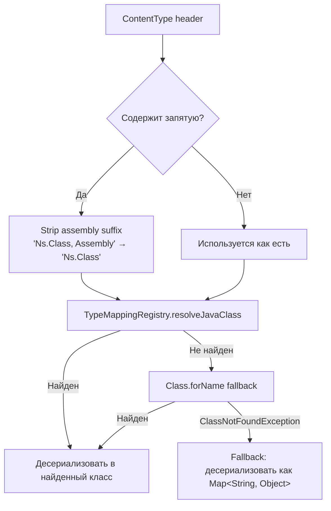

# Wire Protocol: C#/Java Interop

> **Аудитория:** разработчики Java-адаптеров, которые обмениваются сообщениями с C#-сервисами TCB через RabbitMQ или HTTP.
> **Статус:** актуально для SAL 1.x.
> **Связанные ADR:** ADR-002 (Wire Format), ADR-004 (AMQP Topology).

---

## Содержание

1. [Общие принципы](#1-общие-принципы)
2. [Формат AMQP-сообщения](#2-формат-amqp-сообщения)
3. [Правила JSON-сериализации](#3-правила-json-сериализации)
4. [Wire-формат сессии](#4-wire-формат-сессии)
5. [Передача сессии по HTTP](#5-передача-сессии-по-http)
6. [Контракт топологии RabbitMQ](#6-контракт-топологии-rabbitmq)
7. [Маппинг типов](#7-маппинг-типов)
8. [Намеренные совместимости с C#](#8-намеренные-совместимости-с-c)
9. [Примеры сообщений](#9-примеры-сообщений)
10. [См. также](#10-см-также)

---

## 1. Общие принципы

TCB-SAL использует **JSON over AMQP 0-9-1** (RabbitMQ) как основной транспорт между адаптерами. Java-адаптеры запускаются рядом с C#-адаптерами в одной production-среде — поэтому wire-совместимость является жёстким требованием.

### Стек сериализации

| Слой | Технология |
|---|---|
| Transport | AMQP 0-9-1 (RabbitMQ) |
| Encoding | UTF-8 JSON |
| Java serializer | Jackson `wireObjectMapper` |
| C# serializer | Newtonsoft.Json (default settings + PascalCase) |

### Настройки `wireObjectMapper`

`wireObjectMapper` — специальный `ObjectMapper`, создаваемый `SalSerializationAutoConfiguration`. Он **не заменяет** стандартный Spring MVC ObjectMapper (camelCase), а создаётся отдельно и инжектируется через `@Qualifier("wireObjectMapper")`.

| Параметр | Значение | C#-аналог |
|---|---|---|
| Property naming | `UPPER_CAMEL_CASE` (PascalCase) | Newtonsoft.Json default |
| Null inclusion | `NON_NULL` (null поля не сериализуются) | `NullValueHandling.Ignore` |
| Enum encoding | Строка через `toString()` | `StringEnumConverter` |
| Дата/время | ISO 8601 строка (не timestamp) | `IsoDateTimeConverter` |
| Неизвестные поля | Игнорируются (`FAIL_ON_UNKNOWN_PROPERTIES = false`) | `MissingMemberHandling.Ignore` |

> **Важно:** не используйте стандартный Spring `ObjectMapper` для публикации RabbitMQ-сообщений. Это нарушит wire-совместимость.

---

## 2. Формат AMQP-сообщения

Все сообщения передаются как экземпляры `RecordedMessage`. `SalMessageConverter` отображает поля этого объекта на свойства AMQP-сообщения.

### Таблица маппинга RecordedMessage ↔ AMQP

| Поле `RecordedMessage` | AMQP property | Тип / Формат | Пример |
|---|---|---|---|
| `payload` | Body | UTF-8 JSON-байты | `{"Payload":"hello"}` |
| `payloadType` | ContentType | FQDN типа (C# или Java) | `ru.copperside.sal.example.EchoCommand` |
| `messageId` | MessageId | `long` → строка | `"42"` |
| `correlationId` | CorrelationId | UUID строка | `"550e8400-e29b-41d4-a716-446655440000"` |
| `priority` | Priority | int 0–10 | `5` |
| `timeStamp` | Timestamp | `java.util.Date` (epoch millis) | `1711612800000` |
| `expireDate` | Expiration | мс от `timeStamp` до `expireDate`, строка | `"30000"` |
| `additionalData` + `sourceServiceId` | Header `Additional-Data` | JSON-байты (UTF-8) | `{"SourceServiceId":"svc-id","IsCommand":""}` |

**Дополнительные фиксированные свойства:**

| AMQP property | Значение |
|---|---|
| ContentEncoding | `UTF-8` |
| DeliveryMode | `2` (persistent) |

### Вычисление Expiration

```
expiration_ms = expireDate.toEpochMilli() - timeStamp.toEpochMilli()
```

Expiration устанавливается, только если оба поля заданы и `expiration_ms > 0`. Строка передаётся как `String.valueOf(expiration_ms)`.

### Заголовок Additional-Data

Заголовок `Additional-Data` содержит **JSON-байты** (не строку). Значение — сериализованная `Map<String, String>`, в которую объединяются:
- все поля `additionalData` из `RecordedMessage`
- поле `sourceServiceId` (ключ `"SourceServiceId"`)

Пример содержимого заголовка (до кодирования в байты):
```json
{"SourceServiceId":"my-adapter","IsCommand":"","Confirmtation":"true"}
```

> `Confirmtation` — намеренная опечатка, см. [раздел 8](#8-намеренные-совместимости-с-c).

---

## 3. Правила JSON-сериализации

### PascalCase

Все поля Java-объектов, отправляемых через `wireObjectMapper`, получают PascalCase-ключи:

| Java field | Wire JSON key |
|---|---|
| `payload` | `Payload` |
| `echo` | `Echo` |
| `exeption` | `Exeption` |
| `sourceServiceId` | `SourceServiceId` |

### Пропуск null

Поля со значением `null` в JSON не включаются. Это означает, что C#-десериализатор получает значение по умолчанию для отсутствующих полей.

### Enums

Передаются как строки (результат `enum.toString()`):

```java
// Java
public enum Priority { LOW, NORMAL, HIGH }
// Wire
"Priority": "HIGH"
```

### Даты и время

`java.time.Instant` / `java.time.LocalDateTime` сериализуются в ISO 8601:

```
"2024-03-28T10:15:30.000Z"
```

Использование числового timestamp (unix epoch) не допускается.

### Пример: EchoCommand → wire JSON

**Java-класс:**
```java
@CommandType("ru.copperside.sal.example.EchoCommand")
public class EchoCommand implements HaveResult<EchoResult> {
    private String payload;
}
```

**Wire JSON (тело AMQP-сообщения):**
```json
{
  "Payload": "hello world"
}
```

### Пример: EchoResult → wire JSON

**Java-класс:**
```java
public class EchoResult implements CommandResult {
    private String echo;
}
```

**Wire JSON:**
```json
{
  "Echo": "hello world"
}
```

---

## 4. Wire-формат сессии

Сессия пользователя (`Map<String, Object>`) передаётся в сжатом виде. Java-реализация (`SessionSerializer`) воспроизводит pipeline C# `BinaryWriter` + `DeflateStream` + `Base64`.

### Pipeline сериализации (сжатие)

```
Map<String, Object>
    │
    ▼ wireObjectMapper.writeValueAsString()  [PascalCase JSON]
String (JSON)
    │
    ▼ getBytes(UTF-8)
byte[] (UTF-8)
    │
    ▼ write7BitEncodedInt(length) + байты   [C# BinaryWriter.Write(string)]
byte[] (length-prefixed UTF-8)
    │
    ▼ DeflaterOutputStream (raw DEFLATE, nowrap=true)
byte[] (compressed)
    │
    ▼ Base64.getEncoder().encodeToString()
String (Base64)
```

### Pipeline десериализации (распаковка)

```
String (Base64)
    │
    ▼ Base64.getDecoder().decode()
byte[] (compressed)
    │
    ▼ InflaterInputStream (raw DEFLATE)
InputStream
    │
    ▼ read7BitEncodedInt()           [C# BinaryReader.ReadString() prefix]
int (length)
    │
    ▼ readNBytes(length)
byte[] (UTF-8)
    │
    ▼ new String(bytes, UTF-8)
String (JSON)
    │
    ▼ wireObjectMapper.readValue()
Map<String, Object>
```

### Формат 7-bit encoded int

Реализует алгоритм `BinaryWriter.Write7BitEncodedInt` из .NET. Целое число кодируется в 1–5 байт:

- Берётся 7 бит значения (маска `0x7F`).
- Если оставшиеся биты ненулевые — старший бит байта устанавливается в `1` (маска `0x80`), что означает "есть ещё байты".
- Иначе — старший бит `0`, это последний байт.
- Сдвиг на 7 бит вправо, повтор.

```java
// Запись (Java)
static void write7BitEncodedInt(OutputStream out, int value) throws IOException {
    int v = value;
    while (v >= 0x80) {
        out.write((v & 0x7F) | 0x80);
        v >>= 7;
    }
    out.write(v);
}

// Чтение (Java)
static int read7BitEncodedInt(InputStream in) throws IOException {
    int result = 0, shift = 0, b;
    do {
        b = in.read();
        if (b < 0) throw new IOException("Unexpected end of stream");
        result |= (b & 0x7F) << shift;
        shift += 7;
    } while ((b & 0x80) != 0);
    return result;
}
```

**Примеры кодирования:**

| Длина строки | Байты префикса |
|---|---|
| 0–127 | 1 байт: `[len]` |
| 128–16383 | 2 байта: `[lo\|0x80, hi]` |
| 16384–2097151 | 3 байта |

> **Критично:** C# `DeflateStream` работает в режиме `nowrap=true` (raw DEFLATE без zlib-заголовка). Java `DeflaterOutputStream` по умолчанию добавляет zlib-заголовок. В `SessionSerializer` используется стандартный `DeflaterOutputStream`, который совместим — он использует raw DEFLATE на уровне потока. Убедитесь, что не используется `GZIPOutputStream`.

---

## 5. Передача сессии по HTTP

Сессия вставляется непосредственно в тело HTTP-запроса/ответа. Это поведение реализует `SessionFilter` на стороне Java, повторяя логику C# `SessionDataMiddleware`.

### Заголовок

```
TCB.Header-Session: {bodyOffset};{sessionLength}
```

- `bodyOffset` — длина полезной нагрузки в байтах (до сессии).
- `sessionLength` — длина сессионных данных в байтах.

### Тело запроса

```
[payload bytes: 0 .. bodyOffset]
[session bytes: bodyOffset .. bodyOffset+sessionLength]
```

Сессионные байты — это строка Base64 (результат `SessionSerializer.serialize()`), закодированная в UTF-8.

### Тело ответа

Аналогично запросу:
```
[response payload bytes]
[session bytes]
```

Заголовок ответа:
```
TCB.Header-Session: {responseBodyLen};{sessionLen}
```

### Пример

Запрос с телом `{"op":"pay"}` (11 байт) и сессией `eJyrViq...` (32 байта):

```
Headers:
  TCB.Header-Session: 11;32
  Content-Length: 43

Body (hex, conceptual):
  7b226f70223a22706179227d  ← payload JSON (11 bytes)
  654a797256...             ← Base64 session string (32 bytes)
```

### Прочие HTTP-заголовки SAL

| Заголовок | Константа | Назначение |
|---|---|---|
| `TCB.Header-Session` | `Headers.SESSION` | Сессионные данные |
| `TCB.Header-EnvironmentKey` | `Headers.ENVIRONMENT_KEY` | Ключ окружения |
| `TCB-Header-CheckConfirmation` | `Headers.CHECK_CONFIRMATION` | Признак подтверждения |
| `TCB-Header-IgnoreAP` | `Headers.IGNORE_AP` | Игнорировать AP |
| `TCB-Header-AdapterName` | `Headers.ADAPTER_NAME` | Имя адаптера |
| `TCB-Header-RouteChain` | `Headers.ROUTE_CHAIN` | Цепочка маршрутизации |
| `TCB-Header-ConfirmationCode` | `Headers.CONFIRMATION_CODE` | Код подтверждения |
| `TCB-Header-ConfirmationCodeType` | `Headers.CONFIRMATION_CODE_TYPE` | Тип кода подтверждения |
| `TCB-Header-SerializerType` | `Headers.SERIALIZER_TYPE` | Тип сериализатора |
| `TCB-Header-DeviceId` | `Headers.DEVICE_ID` | ID устройства |
| `TCB-Header-OperationId` | `Headers.OPERATION_ID` | ID операции |
| `TCB-Header-SecurityToken` | `Headers.SECURITY` | Токен безопасности |
| `TCB-Header-Login` | `Headers.LOGIN` | Логин |
| `TCB-Header-Secret` | `Headers.SECRET` | Секрет |
| `TCB-Header-Sign` | `Headers.SIGN` | Подпись |
| `TCB-Header-Timeout` | `Headers.TIMEOUT` | Таймаут |
| `TCB-Header-TimeStamp` | `Headers.TIMESTAMP` | Метка времени |
| `TCB-Header-Origin` | `Headers.ORIGIN` | Источник |

---

## 6. Контракт топологии RabbitMQ

Топология фиксирована и должна точно совпадать с C# `RabbitMQTransport`. Создавать exchanges/queues с другими именами запрещено.

### Exchanges

| Константа | Имя exchange | Тип | Назначение |
|---|---|---|---|
| `COMMAND_EXCHANGE` | `CommandExchange` | Direct | Все команды |
| `COMMAND_COMPLETED_EXCHANGE` | `TCB.Infrastructure.Command.CommandCompletedEvent` | Direct | Результат: успех |
| `COMMAND_FAILED_EXCHANGE` | `TCB.Infrastructure.Command.CommandFailedEvent` | Direct | Результат: ошибка |
| `DEAD_LETTER_EXCHANGE` | `dead-letter-exchange` | Fanout | Dead letter |
| `REJECTED_MESSAGE_EXCHANGE` | `rejected-message-exchange` | Fanout | Отклонённые сообщения |
| _(динамический)_ | `{EventTypeFQDN}` | Fanout | Публикация событий |

### Queues

| Паттерн имени | Назначение | Binding |
|---|---|---|
| `Command_{TypeFullName}` | Обработка команды конкретного типа | `CommandExchange` → routing key = `{TypeFullName}` |
| `{AdapterType}.{AdapterName}_CommandResult` | Получение результатов команд адаптером | `CommandCompletedEvent` + `CommandFailedEvent` → routing key = queue name |
| `{ServiceName}_Event` | Получение событий сервисом | `{EventTypeFQDN}` → routing key = `""` |
| `{ServiceName}_service` | Служебная очередь сервиса | `{EventTypeFQDN}` → routing key = `""` |
| `dead-letter-queue` | Сбор dead letter сообщений | `dead-letter-exchange` |
| `rejected-message-queue` | Сбор отклонённых сообщений | `rejected-message-exchange` |

### Параметры очередей команд

| Параметр | Значение |
|---|---|
| `x-max-priority` | `11` (`COMMAND_MAX_PRIORITY`) |
| `x-dead-letter-exchange` | `dead-letter-exchange` |
| durable | `true` |

---

## 7. Маппинг типов

При получении AMQP-сообщения `SalMessageConverter` должен определить Java-класс для десериализации тела. Алгоритм:



### Регистрация типов

**Способ 1 — аннотация `@CommandType`:**

```java
@CommandType("TCB.KCProcessing.Client.ReversalCommand")
public class ReversalCommand implements Command { ... }
```

При старте Spring Boot Starter сканирует все классы с `@CommandType` и вызывает `TypeMappingRegistry.registerAnnotatedTypes()`.

**Способ 2 — явная регистрация:**

```java
@Autowired
TypeMappingRegistry registry;

// В @PostConstruct или @Configuration:
registry.register("TCB.KCProcessing.Client.ReversalCommand", ReversalCommand.class);
```

### Разрешение имени типа при отправке

При публикации команды `CommandBus` использует обратный маппинг:

```
typeMappingRegistry.resolveCsharpTypeName(commandClass)
    .orElse(commandClass.getName())  // fallback: Java FQDN
```

Если C#-имя не зарегистрировано — в ContentType попадёт Java FQDN. Это допустимо для Java-to-Java коммуникации, но **недопустимо** при взаимодействии с C# потребителями.

---

## 8. Намеренные совместимости с C#

Следующие отклонения от стандартного стиля **зафиксированы намеренно** и не должны исправляться. Они воспроизводят ошибки, присутствующие в оригинальном C# коде TCB.

| Элемент | Проблема | Почему нельзя менять |
|---|---|---|
| `FailedResult.exeption` | Опечатка в имени поля (пропущена `c`). Аннотировано `@JsonProperty("Exeption")`. | C# сервер сериализует это поле как `"Exeption"`. Изменение нарушит десериализацию на стороне C#. |
| `AdditionalData` ключ `"Confirmtation"` | Опечатка (пропущена `i`). Задаётся в `DefaultCommandBus.confirmatoryCommandAsync()`. | C# читает именно ключ `"Confirmtation"`. Правильное написание `"Confirmation"` игнорируется. |
| `SalErrorCodes.NOT_HANDLED_COMMAND_RESULT` | Строка `" NotHandledCommandResult"` начинается с пробела. | C# клиент сравнивает строку с этим значением включая пробел. |

**Код для справки:**

```java
// FailedResult.java — @JsonProperty("Exeption") намеренно
@JsonProperty("Exeption")
private String exeption;

// DefaultCommandBus.java — "Confirmtation" намеренно
rm.getAdditionalData().put("Confirmtation", "true"); // C# typo preserved

// SalErrorCodes.java — ведущий пробел намеренно
public static final String NOT_HANDLED_COMMAND_RESULT = " NotHandledCommandResult"; // leading space preserved from C#
```

---

## 9. Примеры сообщений

### 9.1. EchoCommand — fire-and-forget

Команда без ожидания результата. `CorrelationId` не задаётся, `SourceServiceId` отсутствует.

**AMQP properties:**
```
ContentType:     ru.copperside.sal.example.EchoCommand
ContentEncoding: UTF-8
MessageId:       "1001"
CorrelationId:   (absent)
Priority:        0
DeliveryMode:    2
Timestamp:       1711612800000
Expiration:      (absent)
Exchange:        CommandExchange
RoutingKey:      ru.copperside.sal.example.EchoCommand
```

**Headers:**
```
(нет Additional-Data)
```

**Body (UTF-8 JSON):**
```json
{
  "Payload": "hello world"
}
```

---

### 9.2. EchoCommand — request/reply (с ожиданием результата)

Команда с `CorrelationId` и `SourceServiceId`. `executeCommandAsync()` публикует именно такое сообщение.

**AMQP properties:**
```
ContentType:     ru.copperside.sal.example.EchoCommand
ContentEncoding: UTF-8
MessageId:       "1002"
CorrelationId:   "550e8400-e29b-41d4-a716-446655440000"
Priority:        5
DeliveryMode:    2
Timestamp:       1711612800000
Expiration:      "30000"
Exchange:        CommandExchange
RoutingKey:      ru.copperside.sal.example.EchoCommand
```

**Headers:**
```
Additional-Data: (JSON bytes) {"SourceServiceId":"my-java-adapter"}
```

**Body (UTF-8 JSON):**
```json
{
  "Payload": "hello world"
}
```

---

### 9.3. EchoResult — успешный результат

Публикуется адаптером-обработчиком в `TCB.Infrastructure.Command.CommandCompletedEvent`.

**AMQP properties:**
```
ContentType:     ru.copperside.sal.example.EchoResult
ContentEncoding: UTF-8
MessageId:       "1003"
CorrelationId:   "550e8400-e29b-41d4-a716-446655440000"
Priority:        0
DeliveryMode:    2
Timestamp:       1711612801000
Exchange:        TCB.Infrastructure.Command.CommandCompletedEvent
RoutingKey:      my-java-adapter_CommandResult
```

**Headers:**
```
(нет Additional-Data)
```

**Body (UTF-8 JSON):**
```json
{
  "Echo": "hello world"
}
```

---

### 9.4. FailedResult — ошибка выполнения

Публикуется в `TCB.Infrastructure.Command.CommandFailedEvent` при исключении.

**AMQP properties:**
```
ContentType:     ru.copperside.sal.api.command.FailedResult
ContentEncoding: UTF-8
MessageId:       "1004"
CorrelationId:   "550e8400-e29b-41d4-a716-446655440000"
Priority:        0
DeliveryMode:    2
Timestamp:       1711612801000
Exchange:        TCB.Infrastructure.Command.CommandFailedEvent
RoutingKey:      my-java-adapter_CommandResult
```

**Body (UTF-8 JSON):**
```json
{
  "Exeption": "java.lang.IllegalStateException: something went wrong"
}
```

> Ключ `"Exeption"` — намеренная опечатка, см. [раздел 8](#8-намеренные-совместимости-с-c).

---

### 9.5. Event — публикация события

Событие публикуется в exchange с именем равным FQDN типа события.

**AMQP properties:**
```
ContentType:     ru.copperside.sal.example.PaymentCompletedEvent
ContentEncoding: UTF-8
MessageId:       "2001"
CorrelationId:   (absent)
Priority:        0
DeliveryMode:    2
Timestamp:       1711612802000
Exchange:        ru.copperside.sal.example.PaymentCompletedEvent
RoutingKey:      ""
```

**Headers:**
```
Additional-Data: (JSON bytes) {"SourceServiceId":"payment-adapter"}
```

**Body (UTF-8 JSON):**
```json
{
  "OrderId": "ord-12345",
  "Amount": 1500.00,
  "Currency": "RUB",
  "ProcessedAt": "2024-03-28T10:15:30.000Z"
}
```

---

## 10. См. также

- [`SalMessageConverter`](../sal-spring-boot-starter/src/main/java/ru/copperside/sal/starter/rabbitmq/SalMessageConverter.java) — конвертация RecordedMessage ↔ AMQP Message.
- [`SalRabbitConstants`](../sal-spring-boot-starter/src/main/java/ru/copperside/sal/starter/rabbitmq/SalRabbitConstants.java) — все константы топологии.
- [`SalSerializationAutoConfiguration`](../sal-spring-boot-starter/src/main/java/ru/copperside/sal/starter/serialization/SalSerializationAutoConfiguration.java) — настройка `wireObjectMapper`.
- [`TypeMappingRegistry`](../sal-spring-boot-starter/src/main/java/ru/copperside/sal/starter/serialization/TypeMappingRegistry.java) — реестр маппинга типов C#/Java.
- [`SessionSerializer`](../sal-spring-boot-starter/src/main/java/ru/copperside/sal/starter/session/SessionSerializer.java) — сжатие/распаковка сессии.
- [`SessionFilter`](../sal-spring-boot-starter/src/main/java/ru/copperside/sal/starter/web/SessionFilter.java) — HTTP-фильтр для сессии.
- [`RecordedMessage`](../sal-api/src/main/java/ru/copperside/sal/api/message/RecordedMessage.java) — wire-обёртка сообщения.
- [`FailedResult`](../sal-api/src/main/java/ru/copperside/sal/api/command/FailedResult.java) — результат с ошибкой.
- [`SalErrorCodes`](../sal-api/src/main/java/ru/copperside/sal/api/exception/SalErrorCodes.java) — коды ошибок.
- [`Headers`](../sal-api/src/main/java/ru/copperside/sal/api/constant/Headers.java) — HTTP-заголовки протокола.
- [Руководство по разработке адаптера](adapter-development-guide.md)
- [Архитектура системы](architecture.md)
- [Глоссарий](glossary.md)
